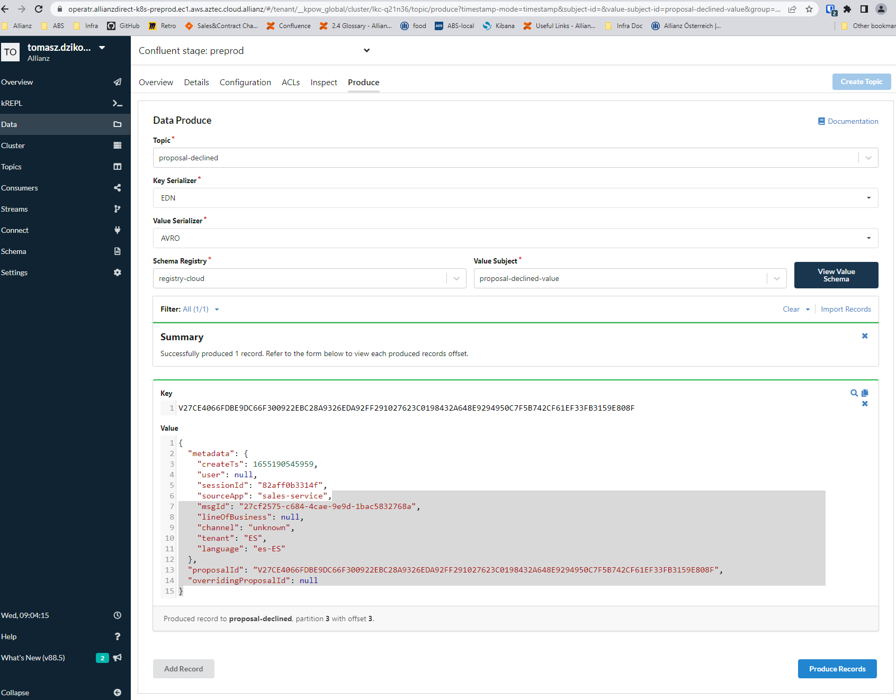

## Sending message to kafka topic 

Message can be sent to kafka message by kpow page.

URLs for kafka kpow tool

Dev	 https://operatr.allianzdirect-k8s-dev.ec1.aws.aztec.cloud.allianz/ \
Test  https://operatr.allianzdirect-k8s-test.ec1.aws.aztec.cloud.allianz/ \
PreProd  https://operatr.allianzdirect-k8s-preprod.ec1.aws.aztec.cloud.allianz/ \
Prod	 https://operatr.allianzdirect-k8s-prod.ec1.aws.aztec.cloud.allianz/ \



example of the message:
```
{
     "metadata": {
       "createTs": 1655190545959,
       "user": null,
       "sessionId": "82aff0b3314f",
       "sourceApp": "sales-service",
       "msgId": "27cf2575-c684-4cae-9e9d-1bac5832768a",
       "lineOfBusiness": null,
       "channel": "unknown",
       "tenant": "ES",
       "language": "es-ES"
     },
     "proposalId": "V27CE4066FDBE9DC66F300922EBC28A9326EDA92FF291027623C0198432A648E9294950C7F5B742CF61EF33FB3159E808F",
     "overridingProposalId": null
   }
   ```