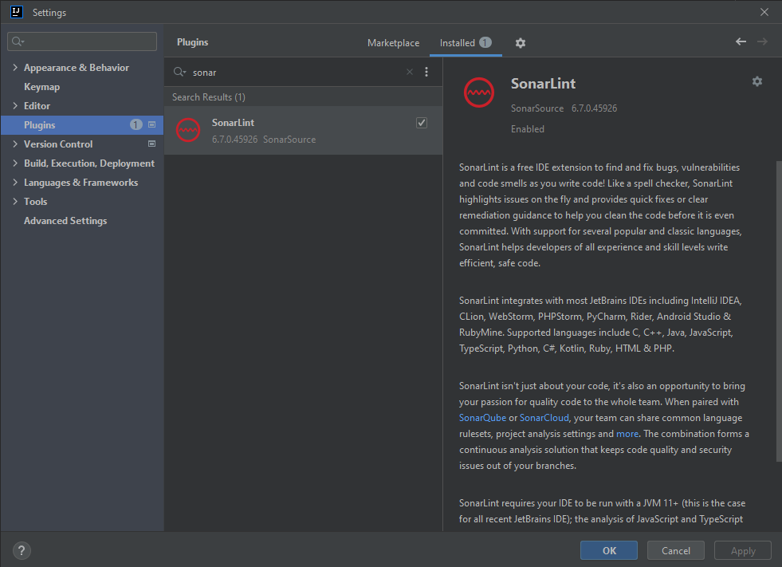
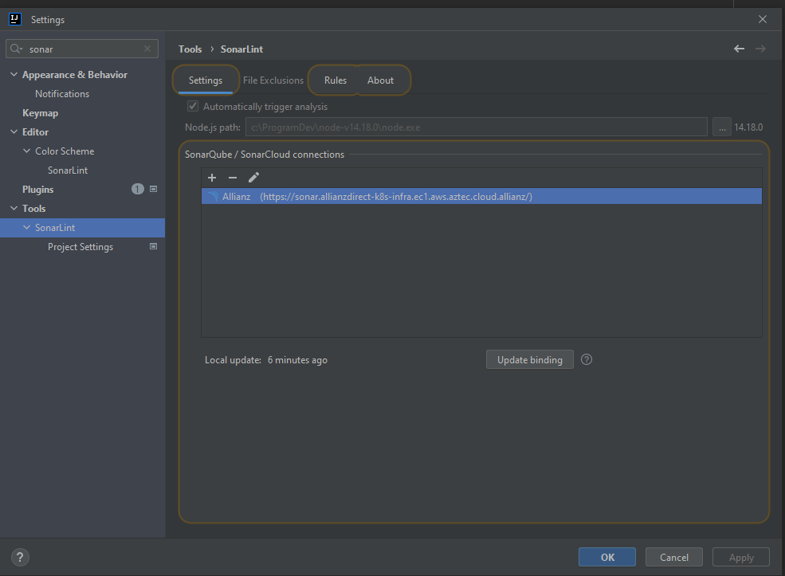

## Sonar Lint configuration in IntelliJ

The sonar lint in Allianz is here: https://sonar.allianzdirect-k8s-infra.ec1.aws.aztec.cloud.allianz/

To configure it in IJ first the SonarLint plugin is required.

Once installed it has to be configured by adding the url and token generated on sonar pager under user profile/security 
